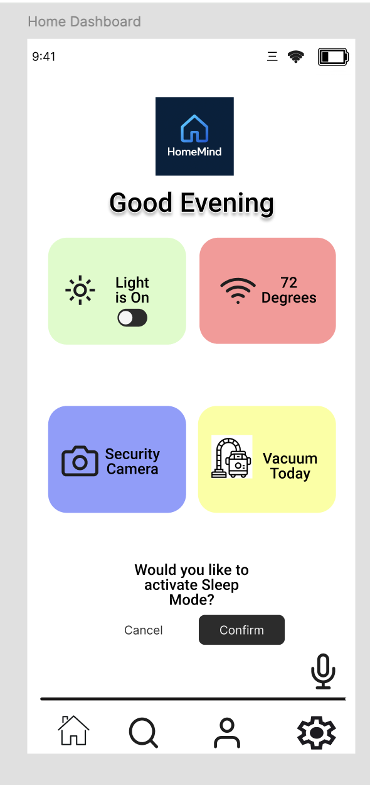
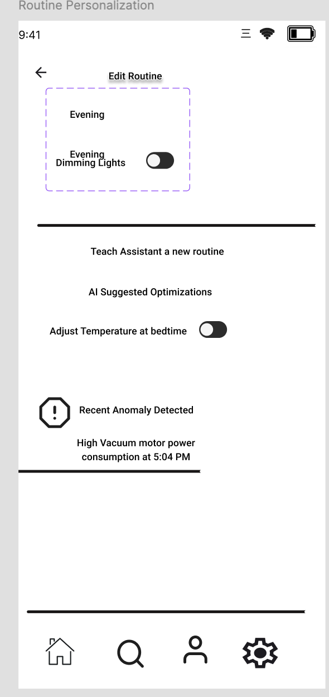
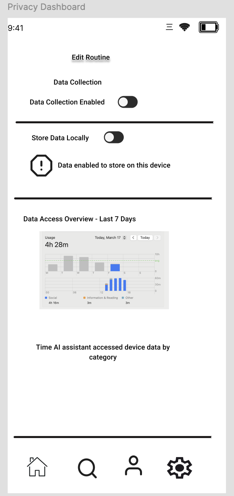
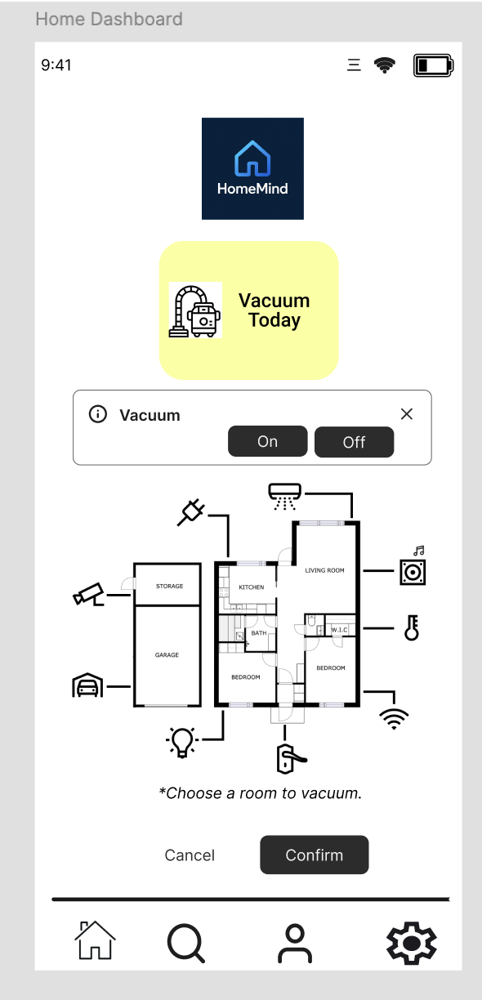
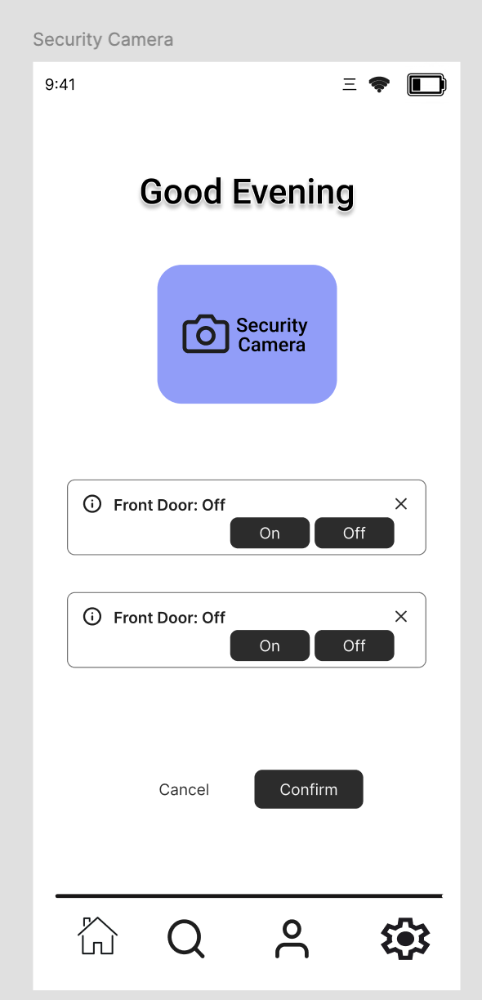
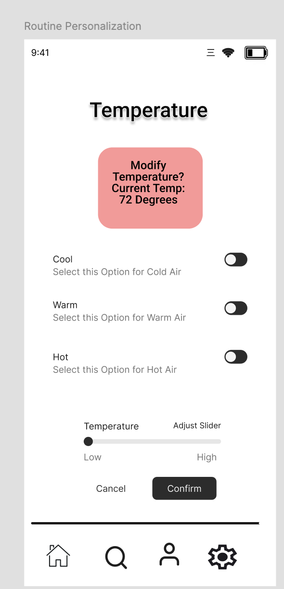
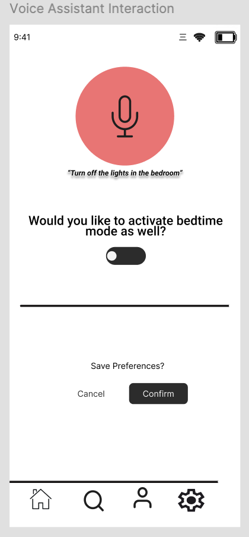
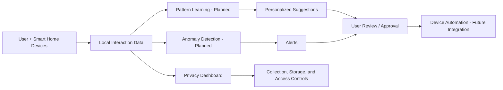

# AI-Powered Smart Home Assistant for Personalization and Privacy

A **Human-Centered AI (HCAI)** smart home assistant concept focused on adaptive automation, transparent data practices, and privacy-preserving local processing.

> **Project status:** Design/prototype. The current project demonstrates the user experience through an interactive Figma prototype. Real-time machine learning, smart-home API integrations, and production device control are future work.

## Overview

Many smart-home platforms depend on fixed routines and cloud-based processing. This project explores a different approach: a smart home assistant that can learn household patterns, suggest personalized routines, detect unusual activity, and give users clear control over what data is collected and stored.

The design emphasizes three goals:

- **Personalization:** learn recurring behaviors and suggest useful routines.
- **Privacy:** favor local/on-device processing rather than sending sensitive household data to the cloud.
- **Transparency and control:** show users what data is used and let them manage collection and storage preferences.

## Prototype Features

### Home dashboard

A unified view for connected devices such as lights, temperature controls, cameras, and a robot vacuum.



### Routine personalization

Users can edit routines, enable AI-suggested optimizations, and review anomaly alerts while remaining in control of automation.



### Privacy dashboard

Users can enable or disable data collection, choose local storage, and review a recent overview of assistant data access.



### Device controls

| Vacuum | Security Camera | Temperature |
| --- | --- | --- |
|  |  |  |

### Voice interaction

The prototype also explores contextual voice commands and routine suggestions.



## Conceptual System Flow



The system is intentionally framed as **human-in-the-loop**: AI can suggest or flag actions, while the user retains oversight and privacy controls.

## Human-Centered AI Principles

The design is grounded in:

- user agency and oversight;
- informed consent and transparent data handling;
- privacy-by-design and local data processing;
- understandable alerts and non-blaming feedback;
- usability across a unified smart-home interface.

## Figma Prototype

[Open the interactive Figma prototype](https://www.figma.com/design/dtVhYIcwOyVlIfEaqyLU75/AI-Smart-Home?node-id=0-1&t=GBzAPyMNDaCWAc7B-1)

## Current Scope vs. Future Implementation

| Area | Current project | Future direction |
| --- | --- | --- |
| User interface | Interactive Figma prototype | Production mobile/web interface |
| Personalization | Designed interaction flows and scenarios | Train and evaluate behavior models |
| Anomaly detection | Conceptual alerts in prototype | Real-time detection from device data |
| Privacy | Privacy dashboard + local-processing design | Edge AI, fine-grained permissions, audit logs |
| Device integration | Simulated smart-device interactions | HomeKit, Google Home, Alexa, SmartThings integrations |
| Accessibility | Limited in current prototype | Screen readers, voice-only flows, multilingual support |

## Future Work

Potential next steps include:

1. Integrate real smart-home platforms and device APIs.
2. Collect consented/anonymized usage data for model development.
3. Prototype local inference using lightweight or edge-AI models.
4. Evaluate personalization accuracy, trust, and usability longitudinally.
5. Add fine-grained permissions, audit logs, and data-expiration controls.
6. Improve accessibility and inclusive design.

See [`project-overview.md`](project-overview.md) for a more detailed project summary and roadmap.

## Team

- [Armel Atayi](https://github.com/ArmelAtayi-glitch) — `@ArmelAtayi-glitch`
- [Qudrat Siyal](https://github.com/qudratusa) — `@qudratusa`
- Rayhaan Manadath
- Ro Mussasa

University of North Carolina at Charlotte — 2025 semester project.

## Repository Structure

```text
ai-smart-home-assistant/
├── README.md
├── CITATION.cff
├── GITHUB_SETUP.md
├── project-overview.md
├── home-dashboard.png
├── privacy-dashboard.png
├── routine-personalization.png
├── security-camera.png
├── temperature-control.png
├── vacuum-control.png
└── voice-assistant.png
```

## License

No open-source license has been selected yet. Until a license is added, standard copyright applies. If the team wants others to reuse the work, choose a license together before publishing one.
